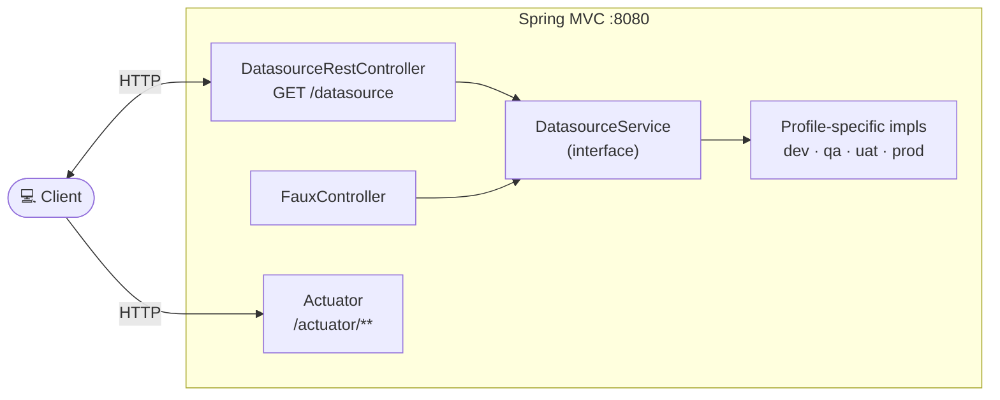

# Spring 6 DI

Spring Boot 4.1.1 / Spring Framework 7 dependency-injection (DI) learning project (Java 25). It demonstrates
constructor injection and profile-driven bean selection (`@Profile` / `@Primary`) with a small
`DatasourceService` hierarchy, exposed through Spring MVC and Spring Boot Actuator.

## Architecture Overview



The application has no database and no authentication. The active `DatasourceService` implementation is
selected purely by the active Spring profile.

## Prerequisites

|    Requirement    | Version  |
|-------------------|----------|
| Java              | 25       |
| Maven Wrapper     | included |
| Docker            | optional |
| Kubernetes / Helm | optional |

## Profiles

|     Profile     |            Bean             | `GET /datasource` |
|-----------------|-----------------------------|-------------------|
| `dev` (default) | `DatasourceServiceDevImpl`  | `dev`             |
| `qa`            | `DatasourceServiceQaImpl`   | `qa`              |
| `uat`           | `DatasourceServiceUatImpl`  | `uat`             |
| `prod`          | `DatasourceServiceProdImpl` | `prod`            |

`DatasourceServiceDevImpl` is also `@Primary` and active for the `default` profile (no explicit profile set).

## Build & Test

```bash
./mvnw clean verify                              # format check, unit tests, ITs, JaCoCo, Helm lint/template
./mvnw clean install                             # verify + local Docker image + Helm package
./mvnw test                                      # unit tests only (surefire, *Test)
./mvnw verify                                    # integration tests only (failsafe, *IT)
./mvnw test -Dtest=DatasourceRestControllerIT    # single test class
./mvnw spotless:apply                            # auto-fix pom/markdown/json/yaml/shell formatting
./mvnw spring-javaformat:apply                   # auto-fix Java code style
```

> Formatting is enforced at the `validate` phase. Run both `spotless:apply` and `spring-javaformat:apply`
> before committing if the build fails there.
>
> **Sandbox quirk:** export `npm_config_bin_links=false` before every `./mvnw` — Spotless (prettier) otherwise
> fails with `EPERM` on the mounted workspace.

## Endpoints

|  Resource   |                   Local                   |            Kubernetes (NodePort)             |
|-------------|-------------------------------------------|----------------------------------------------|
| Application | http://localhost:8080                     | http://\<node-ip\>:30080                     |
| Datasource  | http://localhost:8080/datasource          | http://\<node-ip\>:30080/datasource          |
| Actuator    | http://localhost:8080/actuator            | http://\<node-ip\>:30080/actuator            |
| Health      | http://localhost:8080/actuator/health     | http://\<node-ip\>:30080/actuator/health     |
| Prometheus  | http://localhost:8080/actuator/prometheus | http://\<node-ip\>:30080/actuator/prometheus |

## Observability

- **OpenTelemetry tracing** with W3C `traceparent` propagation and baggage (`testBaggage`), correlation of
  baggage into the MDC.
- **`@Observed`** (Micrometer) on configuration methods (`config.change.listener`).
- **Request logging** via `CommonsRequestLoggingFilter` (headers, query string, payload).
- **Contextual logging**: `ConfigChangeListener` logs all resolved properties on startup (password-like keys and
  values are masked) and `LogMessage` provides stable log IDs.
- **Logstash Logback Encoder** for structured JSON logs; the console pattern includes trace/span IDs and a full
  `MDC` dump.

## IntelliJ HTTP Client

The `restRequest/` folder contains IntelliJ HTTP request files for manual testing:

|           File           |                             Coverage                             |
|--------------------------|------------------------------------------------------------------|
| `rest.http`              | `GET /datasource`                                                |
| `actuator.http`          | Actuator / health endpoints                                      |
| `scripts/traceparent.js` | Generates `traceId`/`spanId` for `traceparent`/`baggage` headers |

Environments are configured in `restRequest/http-client.env.json`:

| Environment | App port |        Use for        |
|-------------|----------|-----------------------|
| `local`     | 8080     | Local run             |
| `k8s`       | 30080    | Kubernetes (NodePort) |

Select the environment in IntelliJ's HTTP client toolbar before running a request.

## Docker

```bash
./mvnw clean install
# or explicitly
./mvnw clean package spring-boot:build-image
```

Run the locally built image:

```bash
docker run --rm -p 8080:8080 local/spring-6-di:development
```

## Kubernetes (Helm)

After `./mvnw clean install`, a packaged chart is placed in `target/helm/repo/`. Deployment goes into the
**`spring-6-di`** namespace.

```powershell
cd target/helm/repo

$file = Get-ChildItem -Filter spring-6-di-chart-*.tgz | Select-Object -First 1
tar -xvf $file.Name

$APPLICATION_NAME = Get-ChildItem -Directory |
  Where-Object { $_.LastWriteTime -ge $file.LastWriteTime } |
  Select-Object -ExpandProperty Name

helm upgrade --install $APPLICATION_NAME ./$APPLICATION_NAME `
  --namespace spring-6-di --create-namespace `
  --wait --timeout 8m --debug --render-subchart-notes
```

### Helm Operations

```powershell
kubectl get pods -n spring-6-di
kubectl logs $POD -n spring-6-di --all-containers     # $POD from the command above
helm status  $APPLICATION_NAME --namespace spring-6-di
helm test    $APPLICATION_NAME --namespace spring-6-di --logs
helm uninstall $APPLICATION_NAME --namespace spring-6-di
kubectl delete all --all -n spring-6-di
```

### Debugging in Kubernetes

```powershell
kubectl run busybox-test --rm -it `
  --image=busybox:1.37.0 `
  --namespace=spring-6-di `
  --command -- sh
```

Verify the application via the actuator endpoint on NodePort **30080**.

## Sandbox

Development in an isolated Docker sandbox via [opencode-sandbox-kit](https://github.com/dboeckli/opencode-sandbox-kit).
Prerequisites: `sbx` CLI, secrets (`sbx secret set github` + `sbx secret set github-maven`), IntelliJ-MCP registration
(`sbx mcp add idea --url http://localhost:64615/stream --skip-ssrf-check`).

Start (PowerShell) — multiline, with `--static-mcp idea`, pinned template version and a read-only host Maven cache
(no re-download of cached dependencies):

```powershell
sbx run opencode `
    --kit "git+https://github.com/dboeckli/opencode-sandbox-kit.git#dir=opencode-agent" `
    --template docker/sandbox-templates:opencode-docker-0.5.0 `
    --no-share-skills `
    --static-mcp idea `
    . `
    "$env:USERPROFILE\.kube:ro" `
    "C:\development\maven-repo:ro"
```

